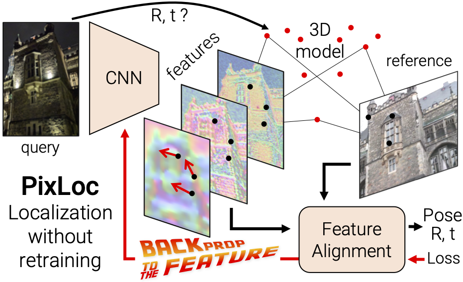

# Back to the Feature with PixLoc

We introduce PixLoc, a neural network for end-to-end learning of camera localization from an image and a 3D model via direct feature alignment. It is presented in our paper:
- [Back to the Feature: Learning Robust Camera Localization from Pixels to Pose](https://arxiv.org/abs/2103.09213)
- to appear at CVPR 2021
- Authors: [Paul-Edouard Sarlin](psarlin.com/)\*, [Ajaykumar Unagar](https://aunagar.github.io/)\*, [Måns Larsson](https://scholar.google.se/citations?user=RoOUjgQAAAAJ&hl=en), [Hugo Germain](https://www.hugogermain.com/), [Carl Toft](https://scholar.google.com/citations?user=vvgmWA0AAAAJ&hl=en), [Viktor Larsson](http://people.inf.ethz.ch/vlarsson/), [Marc Pollefeys](http://people.inf.ethz.ch/pomarc/), [Vincent Lepetit](http://imagine.enpc.fr/~lepetitv/), [Lars Hammarstrand](http://www.chalmers.se/en/staff/Pages/lars-hammarstrand.aspx), [Fredrik Kahl](http://www.maths.lth.se/matematiklth/personal/fredrik/), and [Torsten Sattler](https://scholar.google.com/citations?user=jzx6_ZIAAAAJ&hl=en)

 This repository will host the training and inference code. Please subscribe to [this issue](https://github.com/cvg/pixloc/issues/1) if you wish to be notified of the code release.

<p align="center">
  <a href="https://arxiv.org/abs/2103.09213"></a>
</p>

## Abstract

Camera pose estimation in known scenes is a 3D geometry task recently tackled by multiple learning algorithms. Many regress precise geometric quantities, like poses or 3D points, from an input image. This either fails to generalize to new viewpoints or ties the model parameters to a specific scene. In this paper, we go Back to the Feature: we argue that deep networks should focus on learning robust and invariant visual features, while the geometric estimation should be left to principled algorithms. We introduce PixLoc, a scene-agnostic neural network that estimates an accurate 6-DoF pose from an image and a 3D model. Our approach is based on the direct alignment of multiscale deep features, casting camera localization as metric learning. PixLoc learns strong data priors by end-to-end training from pixels to pose and exhibits exceptional generalization to new scenes by separating model parameters and scene geometry. The system can localize in large environments given coarse pose priors but also improve the accuracy of sparse feature matching by jointly refining keypoints and poses with little overhead.

## BibTex Citation

Please consider citing our work if you use any of the ideas presented the paper or code from this repo:

```
@inproceedings{sarlin21pixloc,
  author    = {Paul-Edouard Sarlin and
               Ajaykumar Unagar and
               Måns Larsson and
               Hugo Germain and
               Carl Toft and
               Viktor Larsson and
               Marc Pollefeys and
               Vincent Lepetit and
               Lars Hammarstrand and
               Fredrik Kahl and
               Torsten Sattler},
  title     = {{Back to the Feature}: Learning Robust Camera Localization from Pixels to Pose},
  booktitle = {CVPR},
  year      = {2021},
  url       = {https://arxiv.org/abs/2103.09213}
}
```
