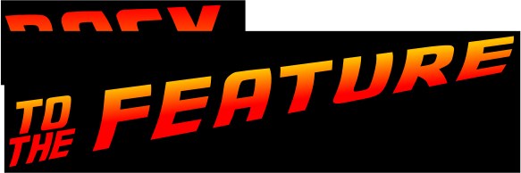
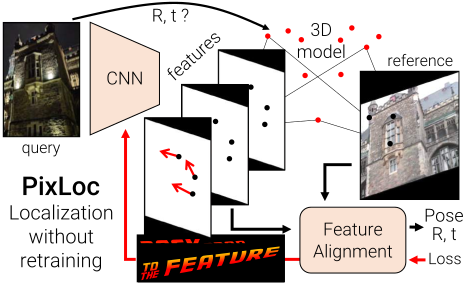
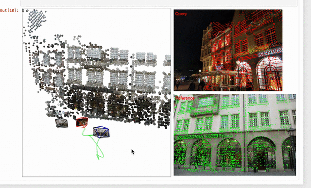
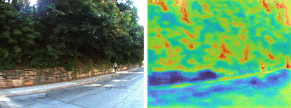

<p align="center">
  <a href="https://psarlin.com/pixloc"></a>
</p>


# Camera Localization from Pixels to Pose

We introduce PixLoc, a neural network that **localizes a given image via direct feature alignment with a 3D model of the environment**. PixLoc is trained end-to-end and is interpretable, accurate, and generalizes to new scenes and across domains, e.g. from outdoors to indoors. It is described in our paper:

- [Back to the Feature: Learning Robust Camera Localization from Pixels to Pose](https://arxiv.org/abs/2103.09213)
- to appear at CVPR 2021
- Authors: [Paul-Edouard Sarlin](psarlin.com/)\*, [Ajaykumar Unagar](https://aunagar.github.io/)\*, [Måns Larsson](https://scholar.google.se/citations?user=RoOUjgQAAAAJ&hl=en), [Hugo Germain](https://www.hugogermain.com/), [Carl Toft](https://scholar.google.com/citations?user=vvgmWA0AAAAJ&hl=en), [Victor Larsson](http://people.inf.ethz.ch/vlarsson/), [Marc Pollefeys](http://people.inf.ethz.ch/pomarc/), [Vincent Lepetit](http://imagine.enpc.fr/~lepetitv/), [Lars Hammarstrand](http://www.chalmers.se/en/staff/Pages/lars-hammarstrand.aspx), [Fredrik Kahl](http://www.maths.lth.se/matematiklth/personal/fredrik/), and [Torsten Sattler](https://scholar.google.com/citations?user=jzx6_ZIAAAAJ&hl=en)
- website: [psarlin.com/pixloc](https://psarlin.com/pixloc) with videos, slides, and visualizations

<p align="center">
  <a href="https://psarlin.com/pixloc"></a>
</p>

## Installation

PixLoc is built with Python >=3.6 and PyTorch. The package `pixloc` includes code for both training and evaluation. Installing the package locally also installs the minimal dependencies listed in `requirements.txt`:

``` bash
git clone https://github.com/cvg/pixloc/
cd pixloc/
pip install -e .
```

Generating visualizations and animations requires extra dependencies that can be installed with:
```bash
pip install -e .[extra]
```

Paths to the datasets and to training and evaluation outputs are defined in [`pixloc/settings.py`](pixloc/settings.py). The default structure is as follows:

```
.
├── datasets     # public datasets
└── outputs
    ├── training # checkpoints and training logs
    ├── hloc     # 3D models and retrieval for localization
    └── results  # outputs of the evaluation
```

## Visualizations

### Demo

Have a look at the Jupyter notebook [`demo.ipynb`](./notebooks/demo.ipynb) to localize an image and animate the predictions in 2D and 3D. This requires downloading the pre-trained weights and the data for either the *Aachen Day-Night* or *Extended CMU Seasons* datasets using:

```
python -m pixloc.download --select checkpoints Aachen CMU --CMU_slices 2
```

<p align="center">
  <a href="./notebooks/demo.ipynb"></a>
  <br /><em>3D viewer in the demo notebook.</em>
</p>

### 3D animations

You can also check out our cool 3D viewer by launching the webserver with `python3 viewer/server.py` and visiting http://localhost:8000/viewer/viewer.html

### Prediction confidences

The notebook [`visualize_confidences.ipynb`](./notebooks/visualize_confidences.ipynb) shows how to visualize the confidences of the predictions over image sequences and turn them into videos.

<p align="center">
  <a href="./notebooks/visualize_confidences.ipynb"></a>
</p>

## Datasets

The codebase can evaluate PixLoc on the following datasets: *7Scenes*, *Cambridge Landmarks*, *Aachen Day-Night*, *Extended CMU Seasons*, and *RobotCar Seasons*. Running the evaluation requires to download the following assets:

- The given dataset;
- Sparse 3D Structure-from-Motion point clouds and results of the image retrieval, both generated with our toolbox [hloc](https://github.com/cvg/Hierarchical-Localization/) and hosted [here](https://cvg-data.inf.ethz.ch/pixloc_CVPR2021/);
- Weights of the model trained on *CMU* or *MegaDepth*, hosted [here](https://cvg-data.inf.ethz.ch/pixloc_CVPR2021/checkpoints/).

We provide a convenient script to download all assets for one or multiple datasets using:

```bash
python -m pixloc.download --select [7Scenes|Cambridge|Aachen|CMU|RobotCar|checkpoints]
```
(see `--help` for additional arguments like `--CMU_slices`)

## Evaluation

To perform the localization on all queries of one of the supported datasets, simply launch the corresponding run script:

```
python -m pixloc.run_[7Scenes|Cambridge|Aachen|CMU|RobotCar]  # choose one
```

Optional flags:

- `--results path_to_output_poses` defaults to `outputs/results/pixloc_[dataset_name].txt`
- `--from_poses` to refine the poses estimated by hloc rather than starting from reference poses
- `--inlier_ranking` to run the oracle baseline using inliers counts of hloc
- `--scenes` to select a subset of the scenes of the *7Scenes* and *Cambridge Landmarks* datasets
- any configuration entry can be overwritten from the command line thanks to [OmegaConf](https://omegaconf.readthedocs.io/en/2.1_branch/usage.html#from-command-line-arguments). For example, to increase the number of reference images, add `refinement.num_dbs=5`.

This displays the evaluation metrics for *7Scenes* and *Cambridge*, while the other datasets require uploading the poses to the evaluation server hosted at [visuallocalization.net](https://www.visuallocalization.net/).

## Training

### Data preparation

<details>
<summary>[Click to expand]</summary>

The 3D point clouds, camera poses, and intrinsic parameters are preprocessed together to allow for fast data loading during training. These files are generated using the scripts `pixloc/pixlib/preprocess_[cmu|megadepth].py`. Such data is also hosted [here](https://cvg-data.inf.ethz.ch/pixloc_CVPR2021/training/) and can be download via:

```
python -m pixloc.download --select CMU MegaDepth --training
```

This also downloads the training split of the *CMU* dataset. The undistorted MegaDepth data (images) can be downloaded [from the D2-Net repository](https://github.com/mihaidusmanu/d2-net#downloading-and-preprocessing-the-megadepth-dataset).

</details>

### Training experiment

<details>
<summary>[Click to expand]</summary>

The training framework and detailed usage instructions are described at [`pixloc/pixlib/`](pixloc/pixlib/). The training experiments are defined by configuration files for which examples are given at [`pixloc/pixlib/configs/`](pixloc/pixlib/configs/). For example, the following command trains PixLoc on the *CMU* dataset:

```bash
python -m pixloc.pixlib.train pixloc_cmu_reproduce \
		--conf pixloc/pixlib/configs/train_pixloc_cmu.yaml
```

- To track the loss and evaluation metrics throughout training, we use Tensorboard:

```bash
tensorboard --logdir outputs/training/
```
Once the validation loss has saturated (around 20k-40k iterations), the training can be interrupted with `Ctrl+C`. All training experiments were conducted with a single RTX 2080 Ti NVIDIA GPU, but the code supports multi-GPU training for faster convergence.

- To investigate the two-view predictions on the validation splits, check out the notebooks [`training_CMU.ipynb`](./notebooks/training_CMU.ipynb) and [`training_MegaDepth.ipynb`](./notebooks/training_MegaDepth.ipynb).

- To evaluate the localization using a newly trained model, simply add the name of your training experiment to the evaluation command, such as:

```bash
python -m pixloc.run_CMU.py experiment=experiment_name
```

</details>

## Running PixLoc on your own data

<details>
<summary>[Click to expand]</summary>

1. Localizing requires calibrated and posed reference images as well as calibrated query images.
2. We also need a sparse SfM point clouds and a list of image pairs obtained with image retrieval. You can easily generate them using our toolbox [hloc](https://github.com/cvg/Hierarchical-Localization/).
3. Taking the `pixloc/run_Aachen.py` as a template, we can copy the file structure of the *Aachen* dataset and/or adjust the variable `default_paths`, which stores local subpaths from `DATA_PATH` and `LOC_PATH` (defined in [`pixloc/settings.py`](pixloc/settings.py)).

</details>

## Extending PixLoc

<details>
<summary>[Click to expand]</summary>

- Different flavors of the Levenberg-Marquardt optimizer with different damping strategies are defined in [`pixloc/pixlib/models/[base|classic|learned]_optimizer.py`](./pixloc/pixlib/models/base_optimizer.py).
- The cost function is defined in [`pixloc/pixlib/geometry/costs.py`](./pixloc/pixlib/geometry/costs.py) and can be easily modified.
- The training-time architecture and loss are defined in [`pixloc/pixlib/models/two_view_refiner.py`](./pixloc/pixlib/models/two_view_refiner.py).
- At inference time, the pose is initialized in [`pixloc/localization/refiners.py`](./pixloc/localization/refiners.py).

</details>

## Goodies

### Viewer

<details>
<summary>[Click to expand]</summary>

We provide in [`viewer/`](./viewer/) a simple web-based visualizer built with [three.js](https://threejs.org/). Quantities of interest (3D points, 2D projections, camera trajectories) are first written to a JSON file and then loaded in the front-end. The trajectory can be animated and individual frames captured to generate a video.

</details>

### Geometry objects

<details>
<summary>[Click to expand]</summary>

We provide in [`pixloc/pixlib/geometry/wrappers.py`](./pixloc/pixlib/geometry/wrappers.py) PyTorch objects for representing SE(3) Poses and Camera models with lens distortion. With a `torch.Tensor`-like interface, these objects support batching, GPU computation, backpropagation, and operations over 3D and 2D points:

```python
from pixloc.pixlib.geometry import Pose, Camera
R    # rotation matrix with shape (B,3,3)
t    # translation vector with shape (B,3)
p3D  # 3D points with shape (B,N,3)

T_w2c = Pose.from_Rt(R, t)
T_w2c = T_w2c.cuda()   # behaves like a torch.Tensor
p3D_c = T_w2c * p3D    # transform points
T_A2C = T_B2C @ T_A2B  # chain Pose objects

cam1 = Camera.from_colmap(dict)     # from a COLMAP dict
cam = torch.stack([cam1, cam2])     # batch Camera objects
p2D, mask = cam.world2image(p3D_c)  # project and undistort
J, mask = cam.J_world2image(p3D_c)  # Jacobian of the projection
```

</details>

### Implementation of GN-Net

<details>
<summary>[Click to expand]</summary>

We provide in [`pixloc/pixlib/models/gnnet.py`](./pixloc/pixlib/models/gnnet.py) a clean implementation of the [Gauss-Newton Network](https://arxiv.org/abs/1904.11932) introduced by Von Stumberg et al., along with [a configuration file](./pixloc/pixlib/configs/train_gnnet_cmu.yaml) to train it on CMU. At inference time, we can run pose estimation with our classical LM optimizer.

</details>

## Disclaimer

Since the publication of the paper, we have substantially refactored the codebase, with many usability improvements and updated dependencies. As a consequence, the results of the evaluation and training might slightly deviate from (and often improve over) the original numbers found in our CVPR 2021 paper. If you are writing a paper, for consistency with the literature, please report the original numbers. If you are building on top of this codebase, consider reporting the latest numbers for fairness.

## BibTex Citation

Please consider citing our work if you use any of the ideas presented the paper or code from this repo:

```
@inproceedings{sarlin21pixloc,
  author    = {Paul-Edouard Sarlin and
               Ajaykumar Unagar and
               Måns Larsson and
               Hugo Germain and
               Carl Toft and
               Victor Larsson and
               Marc Pollefeys and
               Vincent Lepetit and
               Lars Hammarstrand and
               Fredrik Kahl and
               Torsten Sattler},
  title     = {{Back to the Feature: Learning Robust Camera Localization from Pixels to Pose}},
  booktitle = {CVPR},
  year      = {2021},
}
```

Logo font by [Cyril Bourreau](https://www.dafont.com/back-to-the-future.font).
